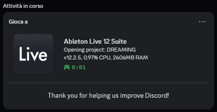

<a id="readme-top"></a>

<!-- PROJECT SHIELDS -->
<div align="center">

[](https://github.com/MihaiStreames/DAWPresence/stargazers)
[](LICENSE)
[](https://github.com/MihaiStreames/DAWPresence/issues)

</div>

<!-- PROJECT LOGO -->
<div align="center">
  <h1>DAWPresence</h1>

  <h3 align="center">Show what you're creating on Discord</h3>

  <p align="center">
    Discord Rich Presence for Digital Audio Workstations
  </p>
</div>

<!-- TABLE OF CONTENTS -->
<details>
  <summary>Table of Contents</summary>
  <ol>
    <li>
      <a href="#about-the-project">About The Project</a>
      <ul>
        <li><a href="#built-with">Built With</a></li>
      </ul>
    </li>
    <li>
      <a href="#getting-started">Getting Started</a>
      <ul>
        <li><a href="#prerequisites">Prerequisites</a></li>
        <li><a href="#installation">Installation</a></li>
      </ul>
    </li>
    <li><a href="#supported-daws">Supported DAWs</a></li>
    <li><a href="#how-it-works">How It Works</a></li>
    <li><a href="#contributing">Contributing</a></li>
    <li><a href="#acknowledgments">Acknowledgments</a></li>
    <li><a href="#license">License</a></li>
  </ol>
</details>

<!-- ABOUT THE PROJECT -->
## About The Project

<div align="center">
  
</div>

DAWPresence monitors your running DAW and displays what you're working on in your Discord profile. It detects your project name from the window title and updates your Rich Presence automatically.

This is a complete rewrite of [Serena1432's DAWRPC](https://github.com/Serena1432/DAWRPC), rebuilt from the ground up with Tauri, Rust, and Svelte.

<p align="right">(<a href="#readme-top">back to top</a>)</p>

### Built With

- [Tauri](https://tauri.app/)
- [Rust](https://www.rust-lang.org/)
- [Svelte 5](https://svelte.dev/)
- [discord-rich-presence](https://crates.io/crates/discord-rich-presence)

<p align="right">(<a href="#readme-top">back to top</a>)</p>

<!-- GETTING STARTED -->
## Getting Started

### Prerequisites

- Windows (Linux/macOS support planned)
- Discord Desktop App

### Installation

Download the latest release from the [Releases](https://github.com/MihaiStreames/DAWPresence/releases) page.

#### Building from Source

```bash
# clone the repo
git clone https://github.com/MihaiStreames/DAWPresence.git
cd DAWPresence/DAWPresence

# install dependencies
pnpm install

# run in dev mode
pnpm tauri dev

# build for production
pnpm tauri build
```

<p align="right">(<a href="#readme-top">back to top</a>)</p>

<!-- SUPPORTED DAWS -->
## Supported DAWs

| DAW | Versions |
|-----|----------|
| FL Studio | 11+ |
| Ableton Live | 9-12 (Intro/Standard/Suite) |
| REAPER | All |
| Bitwig Studio | All |
| Studio One | All |
| LMMS | All |
| Cubase | 14 |

<p align="right">(<a href="#readme-top">back to top</a>)</p>

<!-- HOW IT WORKS -->
## How It Works

DAWPresence scans running processes to detect supported DAWs. When it finds one, it extracts the project name from the window title using regex patterns and updates your Discord Rich Presence.

<p align="right">(<a href="#readme-top">back to top</a>)</p>

<!-- CONTRIBUTING -->
## Contributing

### Adding New DAW Support

1. Create a Discord application at [Discord Developer Portal](https://discord.com/developers/applications)
2. Add a Rich Presence asset named `icon` with the DAW's icon
3. Add an entry to `DAWPresence/src-tauri/daws.json`:

```json
{
  "ProcessName": "YourDAW",
  "DisplayText": "Your DAW Name",
  "TitleRegex": "^(.*?)(?= - Your DAW)",
  "ClientID": "your_discord_client_id",
  "HideVersion": false
}
```

| Field | Type | Description |
|-------|------|-------------|
| `ProcessName` | `string` | Process name without `.exe` |
| `DisplayText` | `string` | Name shown in DAWPresence |
| `TitleRegex` | `string` | Regex to extract project name from window title |
| `ClientID` | `string` | Discord application client ID |
| `HideVersion` | `boolean` | Whether to hide version info |

<p align="right">(<a href="#readme-top">back to top</a>)</p>

<!-- ACKNOWLEDGMENTS -->
## Acknowledgments

- [Serena1432](https://github.com/Serena1432) - Original DAWRPC creator

<p align="right">(<a href="#readme-top">back to top</a>)</p>

<!-- LICENSE -->
## License

MIT. Do whatever you want with it. See [LICENSE](LICENSE) for more information.

<p align="right">(<a href="#readme-top">back to top</a>)</p>

---

<div align="center">

### 🌟 Found this cool?

If you did, consider giving it a star! It helps others discover the project.

Made with ❤️

</div>
