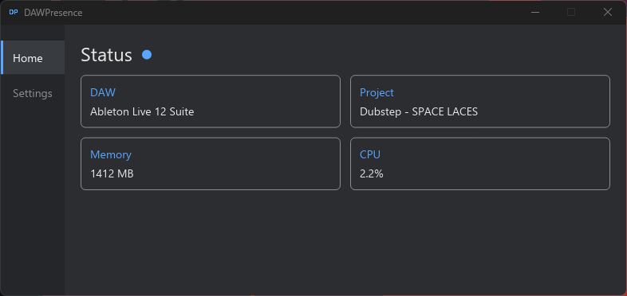
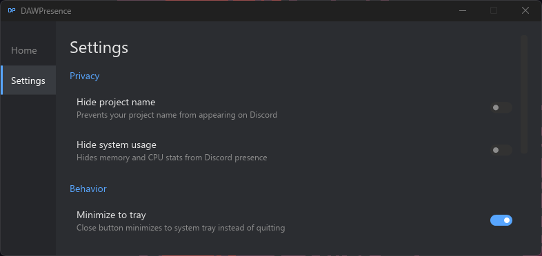
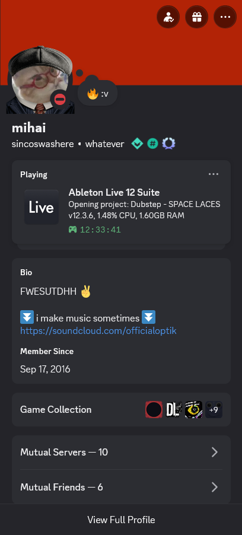

#  DAWPresence

DAWPresence shows what you are creating on Discord. It monitors your running DAW, extracts the project name from the window title, and updates your Rich Presence automatically. Ships as a tiny Windows binary (under 2 MB, zero runtime deps) with an iced GUI and a system tray icon.

[](https://github.com/MihaiStreames/DAWPresence/releases)
[](https://github.com/MihaiStreames/DAWPresence/issues/1)
[](https://github.com/MihaiStreames/DAWPresence/actions/workflows/ci.yml)
[](LICENSE)

<div align="center">
  <table><tr>
    <td>
      
      
    </td>
    <td width="30%">
      
    </td>
  </tr></table>
</div>

## About

Started as a Python rewrite of [Serena1432's DAWRPC](https://github.com/Serena1432/DAWRPC). The original is C# and Windows-only, and I wanted to learn how it worked. Once the Python port was solid I picked Rust to learn the language properly and rewrote the whole thing again. DAWPresence is the result, and my first real Rust project.

## Install

### Installer (recommended)

Download the setup `.exe` from the [latest release](https://github.com/MihaiStreames/DAWPresence/releases/latest). Adds a start menu shortcut, optional desktop shortcut, optional auto-start with Windows.

### Portable

Download `DAWPresence.exe` from the [latest release](https://github.com/MihaiStreames/DAWPresence/releases/latest) and run it. Settings live in `%APPDATA%\dawpresence`.

### From source

On Windows:

> [!NOTE]
> Windows is very annoying, which means that you WILL need MSVC (MSVC Build Tools with Visual C++), which can be obtained in one command that silently gets them for you:
>
> ```pwsh
> winget install Microsoft.VisualStudio.2022.BuildTools --override "--quiet --add Microsoft.VisualStudio.Workload.VCTools --add Microsoft.VisualStudio.Component.VC.Tools.x86.x64 --add Microsoft.VisualStudio.Component.Windows11SDK.22621 --includeRecommended"
> ```
>
> On top of that, if you use `rust-analyzer`, cargo needs `LIB` and `PATH` set system-wide (aka running `vcvars64.bat` or set permanently). The upside is that you don't need `.cargo/config.toml` since MSVC is the default target.

```pwsh
git clone https://github.com/MihaiStreames/DAWPresence.git
cd DAWPresence
cargo build --release
```

On Linux:

> [!NOTE]
> Now on Linux, you need `gcc-mingw-w64-x86-64`:
>
> ```sh
> pacman -S mingw-w64-gcc mingw-w64-binutils # arch
> apt install gcc-mingw-w64-x86-64 # ubuntu
> ```
>
> You then need to make `.cargo/config.toml` so that you don't have to always use `--target x86_64-pc-windows-gnu`:
>
> ```toml
> [build]
> target = "x86_64-pc-windows-gnu"
> ```

```sh
git clone https://github.com/MihaiStreames/DAWPresence.git
cd DAWPresence
cargo build --release # only if you follow the note above, else add --target x86_64-pc-windows-gnu
```

## Prerequisites

- Windows 10 or later
- Discord desktop app

Linux support tracked in [issue #1](https://github.com/MihaiStreames/DAWPresence/issues/1).

## Supported DAWs

| DAW           | Versions                    |
| ------------- | --------------------------- |
| FL Studio     | 11+                         |
| Ableton Live  | 9-12 (Intro/Standard/Suite) |
| REAPER        | All                         |
| Bitwig Studio | All                         |
| Studio One    | All                         |
| LMMS          | All                         |
| Cubase        | 14                          |

## How it works

DAWPresence uses direct Win32 APIs to detect running DAWs. When one is found, it attaches to the process and monitors CPU, RAM, and window title. Project names are extracted via regex patterns from `daws.json`. Process exit is detected instantly via `RegisterWaitForSingleObject` (NT kernel threadpool). Discord Rich Presence updates automatically.

## Adding a new DAW

1. Create a Discord application at the [Discord Developer Portal](https://discord.com/developers/applications).
2. Add a Rich Presence asset named `icon` with the DAW's icon.
3. Add an entry to `daws.json`:

```json
{
  "ProcessName": "YourDAW",
  "DisplayText": "Your DAW Name",
  "TitleRegex": "^(.*?)(?= - Your DAW)",
  "ClientID": "your_discord_client_id",
  "HideVersion": false
}
```

| Field                    | Type       | Description                                     |
| ------------------------ | ---------- | ----------------------------------------------- |
| `ProcessName`            | `string`   | Process name without `.exe`                     |
| `DisplayText`            | `string`   | Name shown in DAWPresence                       |
| `TitleRegex`             | `string`   | Regex to extract project name from window title |
| `ClientID`               | `string`   | Discord application client ID                   |
| `HideVersion`            | `boolean`  | Whether to hide version info                    |
| `AdditionalProcessNames` | `string[]` | Extra process name prefixes to aggregate        |

## Acknowledgments

DAWPresence wouldn't exist without [Serena1432's DAWRPC](https://github.com/Serena1432/DAWRPC). The DAW detection model, the regex-driven project-name extraction, the `daws.json` schema, and the overall shape of the tool all come from there. Grateful to [Serena1432](https://github.com/Serena1432) for building the original.

## License

MIT. See [LICENSE](LICENSE).

<div align="center">
  Made with ❤️
</div>
